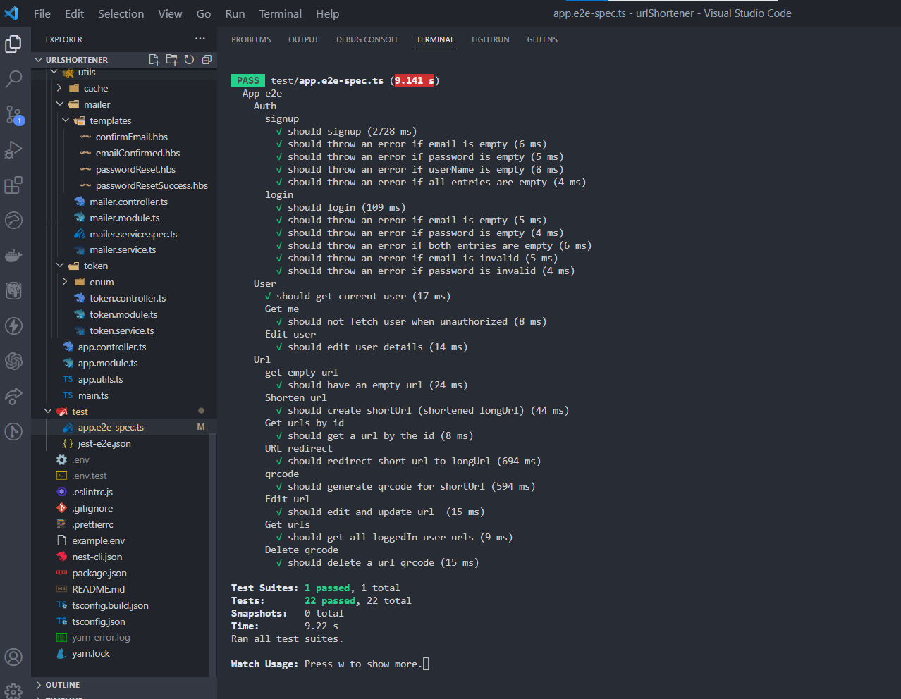

<p align="center">
  <a href="http://nestjs.com/" target="blank"></a>
</p>

[circleci-image]: https://img.shields.io/circleci/build/github/nestjs/nest/master?token=abc123def456
[circleci-url]: https://circleci.com/gh/nestjs/nest

  <p align="center">A progressive <a href="http://nodejs.org" target="_blank">Node.js</a> framework for building efficient and scalable server-side applications.</p>
    <p align="center">
<a href="https://www.npmjs.com/~nestjscore" target="_blank"></a>
<a href="https://www.npmjs.com/~nestjscore" target="_blank"></a>
<a href="https://www.npmjs.com/~nestjscore" target="_blank"></a>
<a href="https://circleci.com/gh/nestjs/nest" target="_blank"></a>
<a href="https://coveralls.io/github/nestjs/nest?branch=master" target="_blank"></a>
<a href="https://discord.gg/G7Qnnhy" target="_blank"></a>
<a href="https://opencollective.com/nest#backer" target="_blank"></a>
<a href="https://opencollective.com/nest#sponsor" target="_blank"></a>
  <a href="https://paypal.me/kamilmysliwiec" target="_blank"></a>
    <a href="https://opencollective.com/nest#sponsor"  target="_blank"></a>
  <a href="https://twitter.com/nestframework" target="_blank"></a>
</p>
  <!--[](https://opencollective.com/nest#backer)
  [](https://opencollective.com/nest#sponsor)-->

# Shortify

## Description

Shortify is a URL shortener app that allow users to create shortened URLs for easier sharing and tracking of links. It provides a simple and convenient way to transform long and complex URLs into short and manageable ones.

---

## Requirements

- Authentication and Authorization

  - User Signup: Allows users to create an account.
  - Email Verification: Sends a token via email for email verification. User email must be verified before logging in. The token expires in 10mins.
  - Resend token: Resends token via email for email verification on user's request if the previous token sent is already invalid.
  - User Login: Enables users to log into their accounts.
  - Forgot Password: Provides a mechanism to reset a forgotten password.
  - Reset Password: Allows users to reset their passwords.
  - Change Password: Enables users to change their current passwords.

- Profile

  - View Profile Details: Displays user profile information, including email and username.
  - Edit Username: Allows users to update their usernames.

- URL Management
  - Create Short URL: Generates shortened links for long URLs.
  - Edit URLs and Details: Provides the ability to modify long URLs, custom names, and titles.
  - View All URLs: Lists all URLs created by the user.
  - View a Particular URL: Displays details of a specific URL.
  - Activate and Deactivate URLs: Allows users to enable or disable URLs.
  - URL Redirection: Automatically redirects shortened URLs to the original long URLs, incrementing the click count.
  - View URL Analytics: Presents analytics for each URL, including the number of clicks, the device used, and the IP address.
  - Generate QR Code: Generates a QR code for the shortened URLs.
  - Delete QR Code: Removes the QR code associated with a URL.
  - Delete URL: Permanently deletes a URL from the user's account.
  <p align="right">(<a href="#readme-top">back to top</a>)</p>

---

## Technologies/Tools used:

- Nestjs
- Prisma ORM
- Postgres Database
- Pactum : Test runner
- Supertest / Jest : For Testing

---

## Installation and Setup

To set up the Shortify API, follow these steps:

1. Clone the repository :

```bash
$ git clone https://github.com/Violacordis/urlShortener.git
```

2. Navigate to the project directory :

```bash
$ cd urlShortener
```

3. Install the dependencies :

```bash
$ yarn install
```

4. Configure the environment variables :

- create your .env file at the root of your project and define your variables using my example.env file.

5. Run prisma generate and migration. This ensures that your database schema is up to date with the latest changes defined in your Prisma schema file (schema.prisma).

```bash
$ npx prisma generate
$ npx prisma migrate dev
```

6. Start your redis server

```bash
# On Ubuntu
$ sudo service redis-server start
```

7. Start the application

```bash
# development
$ yarn run start

# watch mode
$ yarn run start:dev

# production mode
$ yarn run start:prod
```

6. Access the API endpoints using a suitable API testing tool such as Postman or swagger.

<p align="right">(<a href="#readme-top">back to top</a>)</p>

---

## Base URL

- [My shortify API base URL](https://shortify-rg0z.onrender.com)

---

## Shortify app end to end Testing

- 

### API Documentation

- [Postman documentation](https://documenter.getpostman.com/view/22967625/2s93shz9ks)

- [Swagger documentation](https://shortify-rg0z.onrender.com/swagger)

<p align="right">(<a href="#readme-top">back to top</a>)</p>

---

## Contact

- Twitter: [@ikemviola](https://twitter.com/Ikemviola)

- Email: [email](ikemviolacordis@gmail.com)

<p align="right">(<a href="#readme-top">back to top</a>)</p>

---

## Acknowledgement

- [AltschoolAfrica](https://www.altschoolafrica.com/)

---

## Contributor

- Ikem Violacordis Ada

<p align="right">(<a href="#readme-top">back to top</a>)</p>
